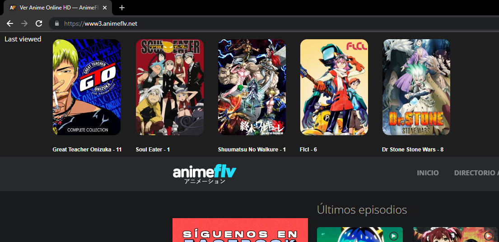

# animeflv-watchlist
Chrome web extension to list the last watched animes.
No login required

## Example 

## Usage
Once you watch an anime, this will be added to the list.  
Now you can 
+ Watch it again
+ Watch the next episode
+ Delete it from the list

> For "security", There is a small timeout of 5 mins before the anime is added or updated
## Installation 

1. Just download the [released zip](https://github.com/artolajon/animeflv-watchlist/releases/tag/v1.3).
1. Extract it somewhere in your pc
1. (Using developer mode in chrome) Add the extension by pointing to its directory.
1. Done :)

Now you just need to access to the [website](https://www3.animeflv.net/)

